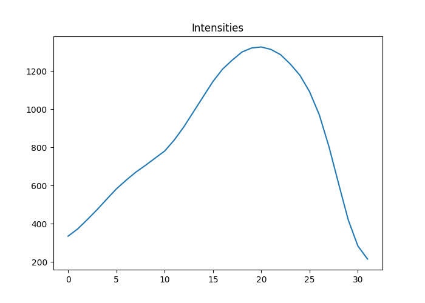

```{r setup, include=FALSE}
knitr::opts_chunk$set(echo = TRUE, engine = 'python3')

```

## Preface

This project was started in March 2018. We had a project to assemble the sequencing data generated using RenSeq (Resistance gene enrichment and Sequencing) method where baits are designed to capture targeted DNA regions for enrichment. However, RenSeq technique has not been used for sequencing and assembling sequencing data. So using simulated RenSeq enriched data, we are trying to answer few questions:
1) how much data is required to generate for enriched data assembly
2) can enriched data give a good assembly?
3) more ... 

## Analysing RenSeq bait capture

RenSeq bait sequence of length 120 bp are designed in the TSL lab. These baits are then added to a pool of genomic DNA fragments where they hybridize to their complementary sequence. As baits are biotinylated, they can be pulled out leaving only the unhybridized DNA fragments. The pulled DNA fragments (which is now captured and enriched) are then sized selected in a gel electrophoresis.

To simulated the DNA enrichment step, we require a minimum base pairing of bait to a DNA fragment. A FASTA file containing 48005 bait sequences and 5 PacBio datasets (after processing for consensus sequence) were obtained. BLAST tool was used to map the bait sequences to the 5 different PacBio consensus datasets for which the baits were designed.

General code for BLASTing a sequence to another is:

blast -db database -query seqToMap.fasta -out output.txt -outfmt 6

From the BLAST output, baits that mapped to PacBio consensus sequences completely and without any gap are selected and the result was sorted in ascending order by bait ID and percentage of mapping identity. The mapping percentage identity was then plotted to visually select the best lowest percentage identity.

```{python, engine.path='usr/bin/python3'}
import sys, json
import operator
import matplotlib
#matplotlib.use('TkAgg')
from matplotlib import pyplot as plt, style
import numpy as np

def get_best_hits(blastresult):
    
    dataset = blastresult.split('/')[1].split('_')[-1].split('.')[0]
    baithits = dict()
    blasthandle = open(blastresult)

    for line in blasthandle:
            line=line.rstrip()
            blastarray=line.split()
            baitname=blastarray[0]
            bait_align_percentage=float(blastarray[1])
            align_length=int(blastarray[3])
            align_gaps=int(blastarray[5])
            
            baithits[baitname] = bait_align_percentage
    blasthandle.close()
    return baithits

def write_json_baithits(jsonfile, baithits):
    # Write the bait with best hits in json file
    with open(jsonfile, 'w') as baithitjsonfile:
        json.dump(baithits, baithitjsonfile, sort_keys=True, indent=4, separators=(',',';'))
        
## Analysing the baits lowest hit %id 
## the first record in these files are the lowest hit, as the hits are in ascending order

pacbiodatasetA='results/baits_mapped_to_pacbio_consensus_datasetA.txt.sorted.ascending'
pacbiodatasetB='results/baits_mapped_to_pacbio_consensus_datasetB.txt.sorted.ascending'
pacbiodatasetC='results/baits_mapped_to_pacbio_consensus_datasetC.txt.sorted.ascending'
pacbiodatasetD='results/baits_mapped_to_pacbio_consensus_datasetD.txt.sorted.ascending'
pacbiodatasetE='results/baits_mapped_to_pacbio_consensus_datasetE.txt.sorted.ascending'

pacbiodatasetA_baithits_ascending=get_best_hits(pacbiodatasetA) 
pacbiodatasetB_baithits_ascending=get_best_hits(pacbiodatasetB) 
pacbiodatasetC_baithits_ascending=get_best_hits(pacbiodatasetC) 
pacbiodatasetD_baithits_ascending=get_best_hits(pacbiodatasetD) 
pacbiodatasetE_baithits_ascending=get_best_hits(pacbiodatasetE)


# plot the bait hits
fig = plt.figure(figsize=(40,25))
bestHitValues = np.array(list(pacbiodatasetA_baithits_ascending.values())); plt.plot(bestHitValues, '.')
bestHitValues = np.array(list(pacbiodatasetB_baithits_ascending.values())); plt.plot(bestHitValues, '.')
bestHitValues = np.array(list(pacbiodatasetC_baithits_ascending.values())); plt.plot(bestHitValues, '.')
bestHitValues = np.array(list(pacbiodatasetD_baithits_ascending.values())); plt.plot(bestHitValues, '.')
bestHitValues = np.array(list(pacbiodatasetE_baithits_ascending.values())); plt.plot(bestHitValues, '.')


plt.title("RenSeq Baits Best of WorstHit Values for 5 different PacBio RSII consensus sequences", fontsize=32)
plt.xlabel("Number of RenSeq baits", fontsize=32)
plt.ylabel("Blast % Hit", fontsize=32)
plt.tick_params(which='both', labelsize=32.00)
plt.legend(['datasetA', 'datasetB', 'datasetC', 'datasetD', 'datasetE'], loc = "center left", bbox_to_anchor = (1, 0.5), fontsize=32, numpoints = 1)
fig.savefig('results/baits_best_of_worsehits_in_5_datasets.png')
fig.show()
```

From the plot, we can visually determined that ~80% of sequence identity is good to hybridize the bait sequences to the genomic DNA fragments for DNA enrichment and sequencing. 

## RenSeq Enriched Gel Image Analysis for Intensity

For this simulation project, we have tried to base our data on true data as much as possible. In order to generate our data, we started with a gel image of RenSeq enriched DNA fragment. So, a gel image of RenSeq baits enriched DNA fragments is obtained for image analysis of DNA fragments. Basically, in a gel electrophoresis, fragmented DNAs move through the channel of pores in the gel towards to positive terminal when electric charge is applied. The smaller DNA fragments move quicker than the longer fragments. Comparing with the known length of DNA fragments (called DNA ladder), DNA fragment of our interest can be identified.

The image is cropped so that only the DNA fragments of interested are captured. In the python code below, image cropping is done to capure the DNA fragments of interests between 6000 to 3500 bps. A point to remember is that the DNA fragments length decrease from top to bottom here.

```{python, engine.path='/usr/bin/python3'}

from matplotlib import pyplot as plt
import pandas as pd
import numpy as np
from PIL import Image
import PIL.ImageOps
import random
import decimal
import json

img = Image.open('enriched_long.tif')
imgCropped = img.crop((890,180, 990, 212))  # cropping 3.5kb to 6kb
plt.imshow(np.asarray(imgCropped), cmap="gray")
```

To understand in basic way, an image is a table of pixels in rows and columns. The intensity data can be obtained from each pixel of an image. For our purpose, an intensity of each pixel in a row is obtained and a mean intensity is calculated. This is done for every row of pixels from top to bottom of the cropped image. Then a sum of mean intensities is calculated which is then used to get the proportion of intensity in each row of pixels in the cropped image. From the porportion of intensities, the cumulative proportion of intensity is obtained from top to the bottom of the cropped image.

The python code for the above process is:
```{python, engine.path='/usr/bin/python3'}
data = np.array(imgCropped, dtype="float64")   # data is a two-dimensional array

graph_intensities = []
intensities = []
cum_proportion = []
intensities=data.mean(axis=1) # get mean by column (axis=1), to get mean by row(axis=0). This is same as doing the for loop below commented
json_intensities=dict()
for data in range(len(intensities)):
    #intensities.append(a.mean())
    json_intensities[str(data)]=intensities[data]

print(json_intensities)

with open("intensities.json", "wt") as jsondata:
    json.dump(json_intensities, jsondata, sort_keys=True, indent=4, separators=(',', ': '))

# get intensities, cumulative intensiteis and cumulative proportions
print("Intensities:")
print(",".join([str(x) for x in intensities[:3]]), "..." , ",".join([str(x) for x in intensities[-3:]]))
total_intensity=sum(intensities)
#print("Total intensity ", total_intensity)
cum_intensities=np.cumsum(intensities)
#print("Cum intensity ", cum_intensities)
proportions=[x/total_intensity for x in intensities]
#print("Proportions", proportions)
cum_proportions=np.cumsum(proportions)
#print("Cum Proportions", cum_proportions)

print("\n\nCumulatative Intensities: ")
print(",".join([str(x) for x in cum_proportions[:3]]),"...", ",".join([str(x) for x in cum_proportions[-3:]]))


max_proportion=max(cum_proportions)
min_proportion=min(cum_proportions)

#Plot intensities, cumulative intensiteis and cumulative proportions
plt.figure()
plt.title("Intensities")
plt.plot(intensities)
plt.savefig('results/Intensities.png')
plt.show()


plt.figure()
plt.title("Cumulative Intensities")
plt.plot(cum_intensities)
plt.savefig('results/cum_intensities.png')
plt.show()

plt.figure()
plt.title("Cumulative Proportions")
plt.plot(cum_proportions)
plt.savefig('results/cum_proportions.png')
plt.show()

```


```{r, echo=FALSE}

```

At this stage, we would want to know the sequence lengths of the DNA fragments in the cropped image. The image of cumulative proportion of intensities (above) shows there are 32 units/rows of intensities. As the image is cropped to get the DNA fragments from 3.5 kb to 6 kb, the length of bases per unit/row, can be calculated as 
```{python, engine.path='/usr/bin/python3'}
unitlength=(6000 - 3500)/32
print("Unit Length = ", unitlength)
```


## Generating Random Sequence Lengths

Now, we know the sequence length at each row of intensities in the cropped image, random sequence lengths can be generated by generating random numbers between 0 and 1 and then converting the those numbers to the reciprocal number between the highest (here 6 kb) and lowest (here 3.5 kb) intensities in the cropped image. To understand this in easy terms, a random number 0 would mean a sequence length of 3.5kb, 1 would mean 6 kb and 0.5 would mean 6000 - (6000 - 3500)/2=4750

The python code to generate random numbers is:
```{python, engine.path='/usr/bin/python3'}
#generate 100,000 random values in normal distribution

num_of_seqs=100000

## generate random values in normal distribution
np.random.seed(19680801) ## seed value for reproducibility
mu, sigma = 0.5, 0.15
random_values = mu + sigma * np.random.randn(100000)

# the histogram of the data
plt.hist(random_values, 50)

plt.xlabel('Random values')
plt.ylabel('Frequency')
plt.title('Histogram of ' + str(num_of_seqs) + ' Random Values')
plt.axis([0,1,0, 7000])
plt.grid(True)
plt.text(0.2,6000, r'Binsize=50')
plt.savefig('results/random_numbers_normal_distribution.png')
plt.show()
```

Code for translating the random values to the reciprocal sequence lengths between 3.5 kb to 6 kb 
```{python, engine.path='/usr/bin/python3'}
# get each point in x-axis in the plot 
unitlength = (6000 - 3500)/32

#print("Each point base pairs: ", unitlength)
# count=0
# for count in range(num_of_seqs):
#     randomvalue=float(random.random())
#     if randomvalue >= min_proportion and randomvalue <=max_proportion:
#         random_values.append(randomvalue)
#         count+=1
        
## convert the random values to sequence lengths
seq_lengths=[round(6000 - x*32*unitlength, 0) for x in random_values]
#print(",".join([str(x) for x in random_values[:3]]), "..." , ",".join([str(x) for x in random_values[-3:]]))
#print(",".join([str(x) for x in seq_lengths[:3]]), "..." , ",".join([str(x) for x in seq_lengths[-3:]]))


## get seq length data into array 
seq_length_data=dict()
for data in range(len(seq_lengths)):
    seq_length_data[str(data)]=seq_lengths[data]

#print(seq_length_data)

## save sequence lengths as json in a file
with open("results/seq_lengths.json", "wt") as seqlengthjson:
    json.dump(seq_length_data, seqlengthjson, sort_keys=True, indent=4, separators=(',', ': '))

seq_lengths=np.array(seq_lengths)
fig=plt.figure(figsize=(20,30))
plt.title("Randomly Generated Enriched Sequence Lengths", fontsize=40)
plt.xlabel("simulated Sequence Lengths", fontsize=32)
plt.ylabel("Frequency", fontsize=32)
plt.tick_params(which='both', labelsize=32.00)
plt.hist(seq_lengths, 50)
plt.text(4000, 6000, r'BinSize=50', fontsize=30)
plt.axis([3000,6000, 0, 7000])
plt.grid(True)
plt.savefig('results/random_sequences_normal_distribution.png')
plt.show()
```


## Generating random sequences from a reference sequence using random sequences lengths

Since, we have random sequence lengths from code above, subsequences of these lengths can be picked out randomly from a given reference sequence. A reference sequence, in FASTA format, generally has multiple sequences. A completed reference sequence has FASTA file with sequences as chromosomal sequences. An incomplete refernce seqeunce has contig/scaffold sequences.

While picking out random subsequences from  
