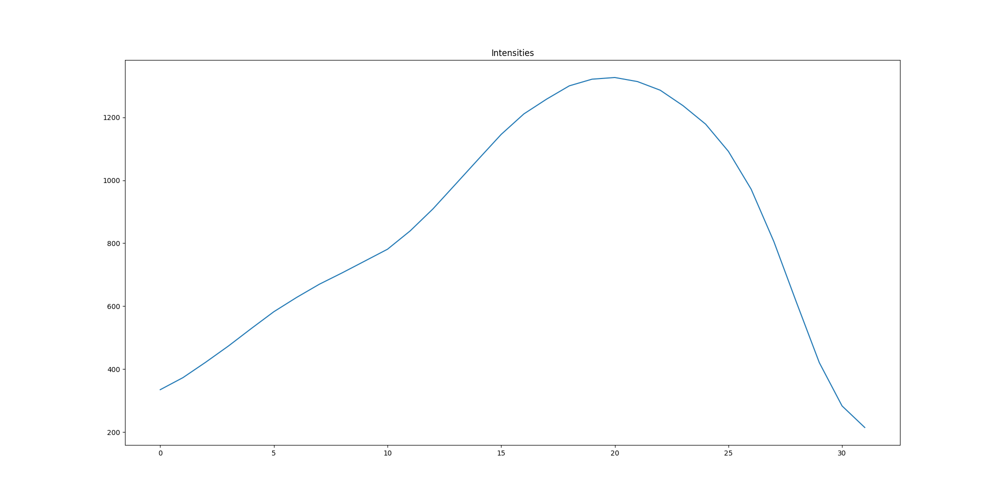

```{r setup, include=FALSE}
knitr::opts_chunk$set(echo = TRUE)
knitr::opts_chunk$set(engine.path = list(
  python = '/usr/bin/python3',
  ruby = '/usr/local/bin/ruby'
))

```

## Preface

This project was started in March 2018. We had a project to assemble the sequencing data generated using RenSeq (Resistance gene enrichment and Sequencing) method where baits are designed to capture targeted DNA regions for enrichment. However, RenSeq technique has not been used for sequencing and assembling sequencing data. So using simulated RenSeq enriched data, we are trying to answer few questions:
1) how much data is required to generate for enriched data assembly
2) can enriched data give a good assembly?
3) more ... 

## Analysing RenSeq bait capture

RenSeq bait sequence of length 120 bp are designed in the TSL lab. These baits are then added to a pool of genomic DNA fragments where they hybridize to their complementary sequence. As baits are biotinylated, they can be pulled out leaving only the unhybridized DNA fragments. The pulled DNA fragments (which is now captured and enriched) are then sized selected in a gel electrophoresis.

To simulated the DNA enrichment step, we require a minimum base pairing of bait to a DNA fragment. A FASTA file containing 48005 bait sequences and 5 PacBio datasets (after processing for consensus sequence) were obtained. BLAST tool was used to map the bait sequences to the 5 different PacBio consensus datasets for which the baits were designed.

General code for BLASTing a sequence to another is:

blast -db database -query seqToMap.fasta -out output.txt -outfmt 6

From the BLAST output, baits that mapped to PacBio consensus sequences completely and without any gap are selected and the result was sorted in ascending order by bait ID and percentage of mapping identity. The mapping percentage identity was then plotted to visually select the best lowest percentage identity.

```{python}
import sys, json
import operator
import matplotlib
#matplotlib.use('TkAgg')
from matplotlib import pyplot as plt, style
import numpy as np

def get_best_hits(blastresult):
    
    dataset = blastresult.split('/')[1].split('_')[-1].split('.')[0]
    baithits = dict()
    blasthandle = open(blastresult)

    for line in blasthandle:
            line=line.rstrip()
            blastarray=line.split()
            baitname=blastarray[0]
            bait_align_percentage=float(blastarray[1])
            align_length=int(blastarray[3])
            align_gaps=int(blastarray[5])
            
            baithits[baitname] = bait_align_percentage
    blasthandle.close()
    return baithits

def write_json_baithits(jsonfile, baithits):
    # Write the bait with best hits in json file
    with open(jsonfile, 'w') as baithitjsonfile:
        json.dump(baithits, baithitjsonfile, sort_keys=True, indent=4, separators=(',',';'))
        
## Analysing the baits lowest hit %id 
## the first record in these files are the lowest hit, as the hits are in ascending order

pacbiodatasetA='results/baits_mapped_to_pacbio_consensus_datasetA.txt.sorted.ascending'
pacbiodatasetB='results/baits_mapped_to_pacbio_consensus_datasetB.txt.sorted.ascending'
pacbiodatasetC='results/baits_mapped_to_pacbio_consensus_datasetC.txt.sorted.ascending'
pacbiodatasetD='results/baits_mapped_to_pacbio_consensus_datasetD.txt.sorted.ascending'
pacbiodatasetE='results/baits_mapped_to_pacbio_consensus_datasetE.txt.sorted.ascending'

pacbiodatasetA_baithits_ascending=get_best_hits(pacbiodatasetA) 
pacbiodatasetB_baithits_ascending=get_best_hits(pacbiodatasetB) 
pacbiodatasetC_baithits_ascending=get_best_hits(pacbiodatasetC) 
pacbiodatasetD_baithits_ascending=get_best_hits(pacbiodatasetD) 
pacbiodatasetE_baithits_ascending=get_best_hits(pacbiodatasetE)


# plot the bait hits
fig = plt.figure(figsize=(40,25))
bestHitValues = np.array(list(pacbiodatasetA_baithits_ascending.values())); plt.plot(bestHitValues, '.')
bestHitValues = np.array(list(pacbiodatasetB_baithits_ascending.values())); plt.plot(bestHitValues, '.')
bestHitValues = np.array(list(pacbiodatasetC_baithits_ascending.values())); plt.plot(bestHitValues, '.')
bestHitValues = np.array(list(pacbiodatasetD_baithits_ascending.values())); plt.plot(bestHitValues, '.')
bestHitValues = np.array(list(pacbiodatasetE_baithits_ascending.values())); plt.plot(bestHitValues, '.')


plt.title("RenSeq Baits Best of WorstHit Values for 5 different PacBio RSII consensus sequences", fontsize=32)
plt.xlabel("Number of RenSeq baits", fontsize=32)
plt.ylabel("Blast % Hit", fontsize=32)
plt.tick_params(which='both', labelsize=32.00)
plt.legend(['datasetA', 'datasetB', 'datasetC', 'datasetD', 'datasetE'], loc = "center left", bbox_to_anchor = (1, 0.5), fontsize=32, numpoints = 1)
fig.savefig('results/baits_best_of_worsehits_in_5_datasets.png')
fig.show()
```

From the plot, we can visualize that ~80% of sequence identity is good to hybridize the bait sequences to the genomic DNA fragments for DNA enrichment and sequencing. 

## RenSeq Enriched Gel Image Analysis for Intensity

For this simulation project, we have tried to base our data on true data as much as possible. In order to generate our data, we started with a gel image of RenSeq enriched DNA fragment. So, a gel image of RenSeq baits enriched DNA fragments is obtained for image analysis of DNA fragments. Basically, in a gel electrophoresis, fragmented DNAs move through the channel of pores in the gel towards to positive terminal when electric charge is applied. The smaller DNA fragments move quicker than the longer fragments. Comparing with the known length of DNA fragments (called DNA ladder), DNA fragment of our interest can be identified.

The image is cropped so that only the DNA fragments of interested are captured. In the python code below, image cropping is done to capure the DNA fragments of interests between 6000 to 3500 bps. A point to remember is that the DNA fragments length decrease from top to bottom here.

```{python}
# Importing modules
from matplotlib import pyplot as plt
import pandas as pd
import numpy as np
from PIL import Image
import PIL.ImageOps
import random
import decimal
import json
```

```{python}
# functions to plot

def plot_data_array(data):
  
  fig=plt.figure(figsize=(20, 10))
  plt.plot(data)
  return fig

def plot_histogram(data):
  
  fig=plt.figure(figsize=(20,10))
  plt.plot(data)
  return fig
```
## Image cropping and analysis
```{python}
img = Image.open('enriched_long.tif')
imgCropped = img.crop((890,180, 990, 212))  # cropping 3.5kb to 6kb
plt.imshow(np.asarray(imgCropped), cmap="gray")
```

To understand in basic way, an image is a table of pixels in rows and columns. The intensity data can be obtained from each pixel of an image. For our purpose, an intensity of each pixel in a row is obtained and a mean intensity is calculated. This is done for every row of pixels from top to bottom of the cropped image. Then a sum of mean intensities is calculated which is then used to get the proportion of intensity in each row of pixels in the cropped image. From the porportion of intensities, the cumulative proportion of intensity is obtained from top to the bottom of the cropped image.

The python code for the above process is:
```{python}
data = np.array(imgCropped, dtype="float64")   # data is a two-dimensional array

graph_intensities = []
intensities = []
cum_proportion = []
intensities=data.mean(axis=1) # get mean by column (axis=1), to get mean by row(axis=0). This is same as doing the for loop below commented
json_intensities=dict()
for data in range(len(intensities)):
    #intensities.append(a.mean())
    json_intensities[str(data)]=intensities[data]

print(json_intensities)

with open("intensities.json", "wt") as jsondata:
    json.dump(json_intensities, jsondata, sort_keys=True, indent=4, separators=(',', ': '))

# get intensities, cumulative intensiteis and cumulative proportions
print("Intensities:")
print(",".join([str(x) for x in intensities[:3]]), "..." , ",".join([str(x) for x in intensities[-3:]]))
total_intensity=sum(intensities)
#print("Total intensity ", total_intensity)
cum_intensities=np.cumsum(intensities)
#print("Cum intensity ", cum_intensities)
proportions=[x/total_intensity for x in intensities]
#print("Proportions", proportions)
cum_proportions=np.cumsum(proportions)
#print("Cum Proportions", cum_proportions)

print("\n\nCumulatative Intensities: ")
print(",".join([str(x) for x in cum_proportions[:3]]),"...", ",".join([str(x) for x in cum_proportions[-3:]]))


max_proportion=max(cum_proportions)
min_proportion=min(cum_proportions)

#Plot intensities, cumulative intensiteis and cumulative proportions
figure=plot_data_array(intensities)
plt.title("Intensities")
plt.savefig('results/Intensities.png')
plt.show()

figure=plot_data_array(cum_intensities)
plt.title("Cumulative Intensities")
plt.savefig('results/cum_intensities.png')
plt.show()

figure=plot_data_array(cum_proportions)
plt.title("Cumulative Proportions")
plt.savefig('results/cum_proportions.png')
plt.show()


```


```{r, echo=FALSE}

```

At this stage, we would want to know the sequence lengths of the DNA fragments in the cropped image. The plots above show that there are 32 units/rows of intensities. As the image is cropped to get the DNA fragments from 3.5 kb to 6 kb, the length of bases per unit/row, can be calculated as

```{python}
unitLength=(6000 - 3500)/32
print("Unit Length = ", unitLength)
```

## Fragments lengths

Now that we know the step of fragment length, these can be obtained as

```{python}
if not unitLength - int(unitLength) == 0:
    unitLength = int(unitLength) + 1
print(unitLength)
fragmentlengths=[]
for x in range(6000, 3500, -(int(unitLength))):
    #print(x)
    fragmentlengths.append(x)
print(fragmentlengths)
```

## Intensity is proportional to number of fragments

The plots show that the intensity increases to a peak level and then decreases. A chemical stain (e.g ethidium bromide) is use for DNA staining. The more the DNA, the more stain is picked up and shows higher intensity in the gel image. We don't know the exact number of genomic DNA fragments in the cropped image. The fragments are extracted from the gel and a library is prepared for sequencing. The number of sequence reads output from a sequencing platform can be called as the estimated number of fragments in the image. The number of sequence reads in five PacBio sequence reads we obtained are as below:

1) DatasetA = 481513
2) DatasetB = 184456
3) DatasetC = 139842
4) DatasetD = 150815
5) DatasetE = 170863

This shows the number of sequence reads obtained from seqeuncing platform can vary. For our purpose, lets assume that we have mean of these five datasets as the mumber of DNA fragments in the image.

```{python}
total_to_generate=int(round(np.mean([481513, 184456, 139842, 150815, 170863])))  # take the mean and then round to the nearest whole number and then to integer

print("Total random sequences to generate = " + str(total_to_generate) + ". This value is obtained by taking the average of 5 PacBio datasets ROI consensus reads")
```

## Number of fragments by intensity

We have assumed the number of fragments in the gel image to be nSequences (above). But we don't know the number of fragments in each row pixels. But this can be obtained by using the proportion of intensity. See code for proportion and cumulative proportion of intensity above.


```{python}
x_sequences=total_to_generate
total_fragments_proportion=[]

for x, y in zip(proportions, cum_proportions):
    #print(int(x * x_sequences))
    total_fragments_proportion.append({"total":int(x * x_sequences), "proportion": x, "cumProportion": y})

seqlength_total_fragments_proportion={}
for x in range(len(fragmentlengths)):
    seqlength_total_fragments_proportion[str(fragmentlengths[x])] = total_fragments_proportion[x]

print(sorted(seqlength_total_fragments_proportion.keys(), reverse=True))
print(seqlength_total_fragments_proportion['3551']["cumProportion"], seqlength_total_fragments_proportion['6000']["cumProportion"])

```

Now, let's see the number of fragments at fragment lengths from 6000 to 3500 bps (fragment lengths decreases from top to bottom)

```{python}
print("Fragment Length\tFragments")
for x in seqlength_total_fragments_proportion.keys():
  print(str(x) + "\t" + str(seqlength_total_fragments_proportion[x]["total"]))
```

We can see that the number of fragments corelates with the intensity of pixels in the gel image; they increases and then decreases from top to bottom.


# Generating Random numbers for retrieving random sequences

Our next object is to generate random number of N sequences where N is our assumed total fragments. The random sequences need to be generated from a complete sequenced reference genome. The chromosome number and a start position need to be chosen randomly and has to be in uniform distribution (as the probability of selecting a chromosome in a genome is equal for all chromosomes ). But to choose a random subsequence from reference genome, we need to generate random numbers. Below is a function for generating random number to select a chromosome.

```{python}
def random_chromosome_selection(number_of_chromosomes, totalSequences):
  return np.random.random_integers(1, number_of_chromosomes, totalSequences)
```

Let's see if the function gives uniform distribution or not

```{python}

data = random_chromosome_selection(10, 200000)    # first parameter is toal number of chromosomes in a genome, second is total no. of simulated sequences to generate
fig=plt.figure(figsize=(20,10))
plt.hist(data)
plt.show()
```

That looks good. The plot looks uniform distribution. Let's write a function to generate a random fragment lengths that covers a range in a row of pixels (i.e if first row of pixel is 6000 bps and second is 5000 bps, it will generate lengths from 5001 to 6000, unitlength is 1000 here)

```{python}
def randomFragmentLength(total_to_generate, sequenceLength):
  return np.random.random_integers((sequenceLength-unitLength), sequenceLength, total_to_generate)
```


Let's write a function to select a start position in a chromosome and it has to be uniform too.


```{python}
def select_start_position(chromosomeLength, subseqLength):
  try:
    assert(chromosome > subseqLength)
  except AssertionError as aerr:
    return None
  
  return np.random.random_integers(1, chromosomeLength-subseqLength)   # gets a random integer between 1 and chromosome - subseqlength)
```


```{python}
#pick a starnd 1 = +, 2 = -
def pickStrand():
  return np.random-randint(1,3)   # 3 is not inclusive
```

Now let's generate randome fragment lengths

```{python}
for x in seqlength_total_fragments_proportion.keys():
  #print(str(x) + "\t" + str(seqlength_total_fragments_proportion[x]["total"]))
  print(randomFragmentLength(int(x), int(seqlength_total_fragments_proportion[x]["total"])))
```

Let's use another model for getting fragment lengths. We will use a random value between 0 and 1 and compare this value with a value of intensity from gel image. If the value falls within a range of intensity, the value denotes the fragment length in that intensity range. So here is the python code for generating fragment lengths 

```{python}
def get_random_number_for_fragment_length(total_to_generate):
  return(np.random.rand(total_to_generate))   # this will generate N random values between 0 and 1
```
Let's plot distribution of total random sequences.

```{python}
data=get_random_number_for_fragment_length(total_to_generate)
fig=plt.figure(figsize=(20,10))
plt.hist(data)
plt.show()
```

The plot above show a uniform distribution of random values representing fragment lengths.  Let's try to generate random value individually in a loop and see how their distribution is.

```{python}

data=[]
for n in range(total_to_generate):
  data.append(np.random.rand())
fig=plt.figure(figsize=(20,10))
plt.hist(data)
plt.show()
```

The plot above also shows uniform distribution of random values representing fragment lengths. Now, let's convert the random values to fragment length based on the cumulative proportional intensities.

```{python}
def get_fragment_length_from_cumproportion(value):
  
  for key in sorted(seqlength_total_fragments_proportion.keys(), reverse=True):
    if value <= seqlength_total_fragments_proportion[key]["cumProportion"]:
      return int(key)

fragment_lengths=[]
for x in data:
  fragment_lengths.append(get_fragment_length_from_cumproportion(x))

for x in fragment_lengths:
  x=int(x)
  print("Counts of " + str(x) + " " + str(fragment_lengths.count(x)))
```

Now, let's plot a histogram of the random fragment lengths.

```{python}
fig=plt.figure(figsize=(20,10))
plt.hist(fragment_lengths)
plt.set_ticklabels(sorted(seqlength_total_fragments_proportion.keys(), reverse=True))
plt.show()
```

